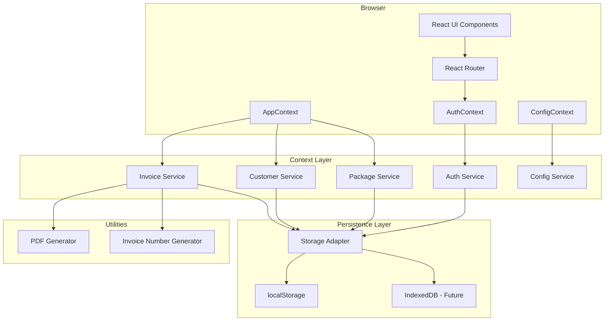
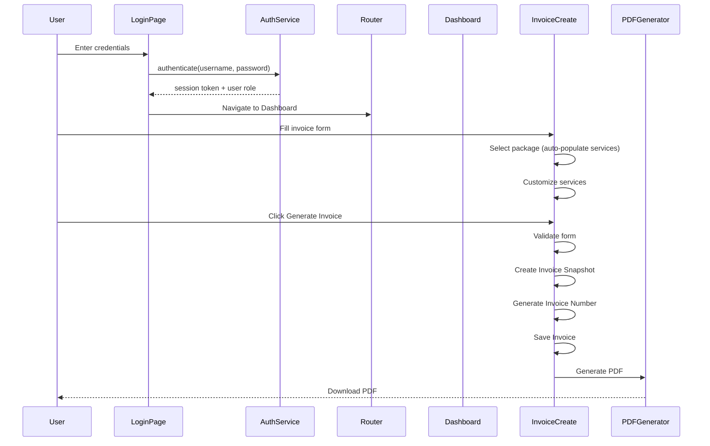

# Technical Design Document: Billing & Invoice Management Portal

## Overview

This document describes the technical architecture and design for extending the existing CandyCapture Photography React application into a production-ready Billing & Invoice Management Portal. The design builds upon the existing React 19 + Vite foundation, extending `AppContext.jsx` with authentication, persistent invoice numbering, package-service relationships, invoice snapshots (immutability), and environment-driven configuration.

### Design Goals

1. **Authentication Layer**: Add secure login/logout with session management and role-based access control
2. **Invoice Immutability**: Capture complete package/service snapshots at invoice creation time
3. **Persistent Invoice Counter**: Implement `CCP-YYYY-NNN` format with counter that survives restarts
4. **Package-Service Relationships**: Extend packages to include lists of services with descriptions
5. **Environment-Driven Configuration**: Enable deployment migration without code changes
6. **Responsive Design**: Support desktop, laptop, tablet, and mobile viewports

### Key Constraints

- Maintain backward compatibility with existing localStorage data where possible
- Invoice snapshots must be independent of later changes to packages/services/studio profile
- No machine-specific paths or settings in source code
- Session timeout after 60 minutes of inactivity

---

## Architecture

### High-Level Architecture Diagram



### Application Flow



---

## Components and Interfaces

### Context Providers Hierarchy

```jsx
<ConfigProvider>
  <AuthProvider>
    <AppProvider>
      <BrowserRouter>
        <App />
      </BrowserRouter>
    </AppProvider>
  </AuthProvider>
</ConfigProvider>
```

### New Context: AuthContext

**Location**: `src/context/AuthContext.jsx`

```typescript
interface AuthContextValue {
  user: User | null;
  isAuthenticated: boolean;
  isAdmin: boolean;
  login: (username: string, password: string) => Promise<LoginResult>;
  logout: () => void;
  updatePassword: (userId: string, newPassword: string) => Promise<boolean>;
  resetPassword: (userId: string, newPassword: string) => Promise<boolean>;
  createUser: (userData: CreateUserData) => Promise<User>;
  updateUser: (userId: string, data: UpdateUserData) => Promise<User>;
  disableUser: (userId: string) => Promise<boolean>;
  getUsers: () => User[];
  getLoginAttempts: (username: string) => LoginAttempt[];
}

interface User {
  id: string;
  username: string;
  role: 'Admin' | 'Staff_User';
  enabled: boolean;
  createdAt: string;
  lastLogin?: string;
}

interface LoginResult {
  success: boolean;
  error?: 'invalid_credentials' | 'account_locked' | 'account_disabled';
  lockoutMinutes?: number;
}
```

### New Context: ConfigContext

**Location**: `src/context/ConfigContext.jsx`

```typescript
interface ConfigContextValue {
  config: AppConfig;
  isConfigured: boolean;
  configErrors: string[];
}

interface AppConfig {
  appUrl: string;
  storageType: 'localStorage' | 'indexedDB';
  pdfStorageLocation: string;
  logoStorageLocation: string;
  sessionTimeoutMinutes: number;
  initialAdminUsername: string;
  initialAdminPassword: string;
}
```

### Extended AppContext Interface

**Location**: `src/context/AppContext.jsx` (extended)

```typescript
interface AppContextValue {
  // Existing
  invoices: Invoice[];
  customers: Customer[];
  services: Service[];
  packages: Package[];
  studio: StudioProfile;
  
  // Invoice operations (enhanced)
  addInvoice: (data: InvoiceCreateData) => Invoice;
  updateInvoice: (id: string, data: InvoiceUpdateData) => void;
  deleteInvoice: (id: string) => void;
  addPayment: (invoiceId: string, payment: PaymentData) => void;
  getInvoiceById: (id: string) => Invoice | undefined;
  
  // Customer operations (unchanged)
  upsertCustomer: (data: CustomerData, invoiceId?: string) => void;
  updateCustomer: (id: string, data: CustomerData) => void;
  deleteCustomer: (id: string) => void;
  getCustomerById: (id: string) => Customer | undefined;
  getCustomerInvoices: (customerId: string) => Invoice[];
  
  // Service operations (unchanged)
  addService: (data: ServiceData) => void;
  updateService: (id: string, data: ServiceData) => void;
  deleteService: (id: string) => void;
  
  // Package operations (enhanced)
  addPackage: (data: PackageCreateData) => void;
  updatePackage: (id: string, data: PackageUpdateData) => void;
  deletePackage: (id: string) => void;
  reorderPackageServices: (packageId: string, serviceIds: string[]) => void;
  
  // Studio operations (unchanged)
  setStudio: (data: StudioProfile) => void;
  
  // Stats
  getStats: (monthFilter?: { month: number; year: number }) => DashboardStats;
  
  // Invoice counter
  getNextInvoiceNumber: () => string;
}
```

### Component Structure

```
src/
├── context/
│   ├── AppContext.jsx          # Extended with snapshots, counter
│   ├── AuthContext.jsx         # NEW: Authentication
│   └── ConfigContext.jsx       # NEW: Configuration
├── components/
│   ├── Layout/
│   │   ├── Sidebar.jsx         # Enhanced with Settings sub-menu
│   │   ├── MobileSidebar.jsx   # NEW: Mobile navigation drawer
│   │   └── Header.jsx          # NEW: Top bar with user menu
│   ├── Auth/
│   │   ├── LoginForm.jsx       # NEW: Login page
│   │   ├── ProtectedRoute.jsx  # NEW: Route guard
│   │   └── AdminRoute.jsx      # NEW: Admin-only route guard
│   ├── Invoice/
│   │   ├── InvoiceForm.jsx     # Enhanced with service customization
│   │   ├── LineItemEditor.jsx  # NEW: Service line item editing
│   │   ├── PackageSelector.jsx # NEW: Package selection with preview
│   │   └── InvoicePDF.jsx      # Enhanced PDF preview
│   ├── Settings/
│   │   ├── ProfileSettings.jsx # Studio profile editor
│   │   ├── AdminPassword.jsx   # NEW: Admin password change
│   │   └── UserManagement.jsx  # NEW: User CRUD
│   └── common/
│       ├── Modal.jsx           # Reusable modal
│       ├── SearchInput.jsx     # Reusable search field
│       └── StatusBadge.jsx     # Payment status badge
├── pages/
│   ├── Login.jsx               # NEW: Login page
│   ├── Dashboard.jsx           # Enhanced with month filter
│   ├── NewInvoice.jsx          # Renamed from InvoiceCreate
│   ├── Invoices.jsx            # Enhanced with filters
│   ├── InvoiceView.jsx         # Enhanced PDF view/download
│   ├── Customers.jsx           # Enhanced (Customer Info)
│   ├── CustomerDetail.jsx      # Enhanced with history
│   ├── Services.jsx            # Enhanced with package-service management
│   └── Settings.jsx            # Enhanced with sub-sections
├── hooks/
│   ├── useAuth.js              # NEW: Auth hook
│   ├── useConfig.js            # NEW: Config hook
│   └── useResponsive.js        # NEW: Viewport detection
├── utils/
│   ├── pdfGenerator.jsx        # Enhanced with snapshot data
│   ├── invoiceNumberGenerator.js # NEW: Persistent counter
│   ├── validators.js           # NEW: Form validation
│   └── storage.js              # NEW: Storage adapter
└── App.jsx                     # Updated with auth routing
```

---

## Data Models

### Invoice (Enhanced)

```typescript
interface Invoice {
  id: string;
  invoiceNumber: string;          // Format: CCP-YYYY-NNN
  createdAt: string;              // ISO timestamp
  
  // Customer snapshot (immutable after creation)
  customerName: string;
  customerMobile: string;
  customerEmail?: string;
  
  // Event details
  eventDate: string;
  eventType?: string;
  location?: string;
  bookingDate: string;
  
  // Package/Service snapshot (immutable after creation)
  snapshot: InvoiceSnapshot;
  
  // Financial
  totalAmount: number;
  paidAmount: number;
  status: 'advance' | 'partial' | 'paid';
  
  // Payments
  payments: Payment[];
  
  // Notes
  notes?: string;
}

interface InvoiceSnapshot {
  packageId?: string;             // Original package ID (for reference only)
  packageName: string;            // Captured package name
  packagePrice: number;           // Captured package price at creation
  lineItems: SnapshotLineItem[];  // Full service details at creation
  studioProfile: StudioProfileSnapshot;
}

interface SnapshotLineItem {
  id: string;
  name: string;
  description?: string;
  quantity: number;
  price: number;                  // Per-unit price (0 for included services)
  isCustom: boolean;              // True if added manually
  isIncluded: boolean;            // True if from package (no additional cost)
}

interface StudioProfileSnapshot {
  name: string;
  address: string;
  mobile: string;
  email?: string;
  instagram?: string;
  website?: string;
  logo?: string;                  // Base64 at time of invoice creation
  signature?: string;
}
```

### Package (Enhanced)

```typescript
interface Package {
  id: string;
  name: string;
  price: number;
  description?: string;
  services: PackageService[];     // NEW: List of included services
  active: boolean;
  createdAt: string;
  updatedAt: string;
}

interface PackageService {
  id: string;                     // Unique within package
  serviceId?: string;             // Reference to Service (optional)
  name: string;
  description?: string;
  quantity: number;
  sortOrder: number;
}
```

### Service (Unchanged)

```typescript
interface Service {
  id: string;
  name: string;
  description?: string;
  active: boolean;
}
```

### Customer (Enhanced)

```typescript
interface Customer {
  id: string;
  name: string;
  mobile: string;
  email?: string;
  invoiceIds: string[];
  createdAt: string;
  
  // Computed (not stored, calculated on access)
  // totalBilled: number;
  // totalPaid: number;
  // totalPending: number;
}
```

### User (New)

```typescript
interface User {
  id: string;
  username: string;
  passwordHash: string;           // bcrypt or similar
  role: 'Admin' | 'Staff_User';
  enabled: boolean;
  createdAt: string;
  lastLogin?: string;
}

interface LoginAttempt {
  username: string;
  timestamp: string;
  success: boolean;
}
```

### Invoice Counter (New)

```typescript
interface InvoiceCounter {
  year: number;
  lastNumber: number;
  updatedAt: string;
}
```

### Seeded Packages Data

```typescript
const SEEDED_PACKAGES: Package[] = [
  {
    id: 'seed_p1',
    name: 'PREMIUM PACKAGE 1',
    price: 75000,
    description: 'Complete wedding coverage',
    active: true,
    services: [
      { id: 'sp1_1', name: 'Traditional Photography', quantity: 1, sortOrder: 1 },
      { id: 'sp1_2', name: 'Traditional Videography', quantity: 1, sortOrder: 2 },
      { id: 'sp1_3', name: 'Candid Photography', quantity: 1, sortOrder: 3 },
      { id: 'sp1_4', name: 'Pre Wedding Photo', quantity: 1, sortOrder: 4 },
      { id: 'sp1_5', name: '200 Photos & 50 Sheet Premium Album', quantity: 1, sortOrder: 5 },
      { id: 'sp1_6', name: 'Documentary Highlight Video', quantity: 1, sortOrder: 6 },
      { id: 'sp1_7', name: 'Wedding Full Function Video', quantity: 1, sortOrder: 7 },
      { id: 'sp1_8', name: 'Complimentary 2 Photo Frames', quantity: 1, sortOrder: 8 },
      { id: 'sp1_9', name: 'Photo Table Frame and Calendar', quantity: 1, sortOrder: 9 },
    ],
  },
  {
    id: 'seed_p2',
    name: 'PREMIUM PACKAGE 2',
    price: 45000,
    description: 'Standard wedding coverage',
    active: true,
    services: [
      { id: 'sp2_1', name: 'Traditional Photography', quantity: 1, sortOrder: 1 },
      { id: 'sp2_2', name: 'Traditional Videography', quantity: 1, sortOrder: 2 },
      { id: 'sp2_3', name: 'Pre Wedding Photo', quantity: 1, sortOrder: 3 },
      { id: 'sp2_4', name: '100 Photos & 35 Sheet Premium Album', quantity: 1, sortOrder: 4 },
      { id: 'sp2_5', name: 'Documentary Highlight Video', quantity: 1, sortOrder: 5 },
      { id: 'sp2_6', name: 'Wedding Full Function Video', quantity: 1, sortOrder: 6 },
      { id: 'sp2_7', name: 'Complimentary 2 Photo Frames', quantity: 1, sortOrder: 7 },
      { id: 'sp2_8', name: 'Photo Table Frame and Calendar', quantity: 1, sortOrder: 8 },
    ],
  },
  {
    id: 'seed_p5',
    name: 'PREMIUM PACKAGE 5',
    price: 210000,
    description: 'Comprehensive premium coverage',
    active: true,
    services: [
      { id: 'sp5_1', name: 'One Traditional Photo', quantity: 1, sortOrder: 1 },
      { id: 'sp5_2', name: 'One Traditional Video', quantity: 1, sortOrder: 2 },
      { id: 'sp5_3', name: 'One Candid Photo', quantity: 1, sortOrder: 3 },
      { id: 'sp5_4', name: 'Two Candid Video', quantity: 1, sortOrder: 4 },
      { id: 'sp5_5', name: 'One Drone', quantity: 1, sortOrder: 5 },
      { id: 'sp5_6', name: 'Pre or Post Wedding', quantity: 1, sortOrder: 6 },
      { id: 'sp5_7', name: 'Two Album + One Candid Album', quantity: 1, sortOrder: 7 },
      { id: 'sp5_8', name: 'Pen Drive + Harddisk', quantity: 1, sortOrder: 8 },
      { id: 'sp5_9', name: 'Four Photo Frames', quantity: 1, sortOrder: 9 },
      { id: 'sp5_10', name: 'Two Candid Video + Two Teaser', quantity: 1, sortOrder: 10 },
      { id: 'sp5_11', name: 'One E-Invite', quantity: 1, sortOrder: 11 },
      { id: 'sp5_12', name: 'Two Traditional Film', quantity: 1, sortOrder: 12 },
    ],
  },
  {
    id: 'seed_p4',
    name: 'PREMIUM PACKAGE 4',
    price: 250000,
    description: 'Ultimate premium coverage',
    active: true,
    services: [
      { id: 'sp4_1', name: 'One Traditional Photo', quantity: 1, sortOrder: 1 },
      { id: 'sp4_2', name: 'One Traditional Video', quantity: 1, sortOrder: 2 },
      { id: 'sp4_3', name: 'Two Candid Photo', quantity: 1, sortOrder: 3 },
      { id: 'sp4_4', name: 'Two Candid Video', quantity: 1, sortOrder: 4 },
      { id: 'sp4_5', name: 'One Drone', quantity: 1, sortOrder: 5 },
      { id: 'sp4_6', name: 'Pre or Post Wedding', quantity: 1, sortOrder: 6 },
      { id: 'sp4_7', name: 'Two Album + One Candid Album', quantity: 1, sortOrder: 7 },
      { id: 'sp4_8', name: 'Pen Drive + Harddisk', quantity: 1, sortOrder: 8 },
      { id: 'sp4_9', name: 'Four Photo Frames', quantity: 1, sortOrder: 9 },
      { id: 'sp4_10', name: 'Two Candid Video + Two Teaser', quantity: 1, sortOrder: 10 },
      { id: 'sp4_11', name: 'One E-Invite', quantity: 1, sortOrder: 11 },
      { id: 'sp4_12', name: 'Two Traditional Film', quantity: 1, sortOrder: 12 },
    ],
  },
];
```

---

## Error Handling

### Authentication Errors

| Error Code | Condition | User Message |
|------------|-----------|--------------|
| `invalid_credentials` | Wrong username or password | "Invalid username or password. Please try again." |
| `account_locked` | 5 failed attempts in 15 minutes | "Account temporarily locked. Please try again in {minutes} minutes." |
| `account_disabled` | Account disabled by admin | "Invalid username or password. Please try again." (same as invalid) |
| `session_expired` | 60 minutes of inactivity | Redirect to login with message "Your session has expired. Please log in again." |

### Form Validation Errors

| Field | Validation | Error Message |
|-------|------------|---------------|
| Customer Name | Non-empty | "Customer name is required" |
| Mobile Number | 10-15 digits | "Mobile number must be 10-15 digits" |
| Event Date | Valid date | "Please select a valid event date" |
| Gmail | Email format (if provided) | "Please enter a valid email address" |
| Total Amount | Positive number | "Total amount must be greater than 0" |
| Password | 8-128 characters | "Password must be 8-128 characters" |
| Username | 1-150 characters, unique | "Username must be 1-150 characters" / "Username already exists" |

### PDF Generation Errors

```typescript
interface PDFError {
  type: 'generation_failed' | 'download_failed';
  message: string;
  invoiceId: string;
  retryable: boolean;
}
```

When PDF generation fails:
1. Display error toast: "PDF generation failed. The invoice has been saved."
2. Keep invoice in Invoices list
3. Show "Retry Download" button on invoice view

### Configuration Errors

At startup, if required configuration is missing:
- Halt startup
- Display each missing config value by name
- Do not start in partially configured state

---

## Testing Strategy

### Unit Testing Approach

Unit tests will focus on:
- **Validation functions**: Input validation for forms
- **State calculations**: `calcStatus`, invoice totals, dashboard stats
- **Invoice number generation**: Sequence uniqueness, year rollover
- **Snapshot creation**: Ensuring immutability of captured data

### Integration Testing Approach

Integration tests will cover:
- **Authentication flow**: Login, logout, session timeout
- **Invoice creation workflow**: Form → validation → snapshot → save → PDF
- **Customer auto-creation**: Invoice generates customer record
- **Payment status updates**: Payments update status correctly

### Test Framework

- **Unit tests**: Vitest (compatible with Vite)
- **Component tests**: React Testing Library
- **E2E tests**: Playwright (future consideration)

### Key Test Scenarios

1. **Invoice Number Persistence**
   - Create invoice, get number N
   - Restart application
   - Create invoice, verify number is N+1

2. **Invoice Snapshot Immutability**
   - Create invoice with package P
   - Modify package P's price and services
   - Verify original invoice shows snapshot values

3. **Authentication Security**
   - 5 failed login attempts → 15 minute lockout
   - Session expires after 60 minutes inactivity
   - Disabled account shows same error as invalid

4. **PDF Generation Retry**
   - Simulate PDF failure
   - Verify invoice saved
   - Verify retry mechanism works

---

## Implementation Notes

### Invoice Number Generation Algorithm

```javascript
function getNextInvoiceNumber() {
  const currentYear = new Date().getFullYear();
  let counter = load('ccp_invoice_counter', { year: currentYear, lastNumber: 0 });
  
  // Reset counter if year changed
  if (counter.year !== currentYear) {
    counter = { year: currentYear, lastNumber: 0 };
  }
  
  // Increment
  counter.lastNumber += 1;
  
  // Save immediately (before returning) to prevent duplicates
  save('ccp_invoice_counter', counter);
  
  // Format: CCP-YYYY-NNN (or more digits if > 999)
  const paddedNumber = String(counter.lastNumber).padStart(3, '0');
  return `CCP-${currentYear}-${paddedNumber}`;
}
```

### Session Management

```javascript
const SESSION_TIMEOUT_MS = 60 * 60 * 1000; // 60 minutes

function checkSessionValidity() {
  const lastActivity = load('ccp_last_activity');
  if (!lastActivity) return false;
  
  const elapsed = Date.now() - new Date(lastActivity).getTime();
  return elapsed < SESSION_TIMEOUT_MS;
}

function updateLastActivity() {
  save('ccp_last_activity', new Date().toISOString());
}
```

### Login Attempt Tracking

```javascript
const MAX_ATTEMPTS = 5;
const LOCKOUT_WINDOW_MS = 15 * 60 * 1000; // 15 minutes

function isAccountLocked(username) {
  const attempts = load('ccp_login_attempts', [])
    .filter(a => a.username === username && !a.success);
  
  // Filter to last 15 minutes
  const recentAttempts = attempts.filter(a => 
    Date.now() - new Date(a.timestamp).getTime() < LOCKOUT_WINDOW_MS
  );
  
  return recentAttempts.length >= MAX_ATTEMPTS;
}
```

### Responsive Breakpoints

```javascript
const BREAKPOINTS = {
  mobile: 480,
  tablet: 768,
  laptop: 1024,
  desktop: 1280,
};

// CSS approach using media queries
// Mobile: sidebar becomes drawer/hamburger menu
// Tablet: sidebar collapses to icons only
// Desktop: full sidebar visible
```

### Storage Keys

| Key | Description |
|-----|-------------|
| `ccp_invoices` | Invoice array |
| `ccp_customers` | Customer array |
| `ccp_services` | Service array |
| `ccp_packages` | Package array (enhanced structure) |
| `ccp_studio` | Studio profile |
| `ccp_users` | User array |
| `ccp_session` | Current session data |
| `ccp_last_activity` | Last activity timestamp |
| `ccp_login_attempts` | Login attempt records |
| `ccp_invoice_counter` | Invoice counter state |
| `ccp_config` | Application configuration |

### Migration from Existing Data

When loading existing data:
1. Check for old package format (no `services` array)
2. If old format, migrate to new format with empty `services` array
3. Preserve all existing invoices as-is (they don't need snapshots since they're already created)
4. New invoices will get full snapshot treatment

---

## Correctness Properties

*A property is a characteristic or behavior that should hold true across all valid executions of a system—essentially, a formal statement about what the system should do. Properties serve as the bridge between human-readable specifications and machine-verifiable correctness guarantees.*

### Property 1: Authentication Route Protection

*For any* route path that is not the login route (`/login`), when a user is not authenticated (no valid session), the Auth_Service SHALL redirect the user to the login page.

**Validates: Requirements 1.1**

### Property 2: Username and Password Field Length Validation

*For any* username string and password string:
- The username field SHALL accept strings of length 1-150 characters and reject strings outside this range
- The password field SHALL accept strings of length 8-128 characters and reject strings outside this range

**Validates: Requirements 1.3, 2.3**

### Property 3: Session Timeout Validity

*For any* session and inactivity duration:
- If the inactivity duration is less than 60 minutes, the session SHALL remain valid
- If the inactivity duration is 60 minutes or greater, the session SHALL be invalid and require re-authentication

**Validates: Requirements 1.4**

### Property 4: Username Uniqueness Enforcement

*For any* existing user with username U, attempting to create a new user with the same username U (case-insensitive) SHALL be rejected with a uniqueness violation error.

**Validates: Requirements 2.2**

### Property 5: Dashboard Month Filter Scoping

*For any* set of invoices and any selected month/year filter, the Dashboard SHALL display metrics (events, income, pending, customers) calculated only from invoices whose event date falls within the selected month and year.

**Validates: Requirements 5.3, 5.4**

### Property 6: Dashboard Totals Calculation

*For any* set of invoices:
- Total Income SHALL equal the sum of `paidAmount` across all invoices
- Pending Amount SHALL equal the sum of (`totalAmount` - `paidAmount`) across all invoices

**Validates: Requirements 5.5**

### Property 7: Line Item Total Recalculation

*For any* invoice with line items, after any add, remove, or edit operation on line items, the invoice Total Amount SHALL equal the base package price plus the sum of all custom line item prices (quantity × price per unit).

**Validates: Requirements 7.6**

### Property 8: Pending Amount Calculation

*For any* invoice with a Total Amount and an Advance amount, the Pending_Amount SHALL always equal Total Amount minus Advance, calculated automatically without manual entry.

**Validates: Requirements 8.2, 8.3**

### Property 9: Form Field Validation

*For any* invoice form input:
- Customer Name validation SHALL pass if and only if the string is non-empty after trimming whitespace
- Mobile Number validation SHALL pass if and only if the string contains 10-15 digits
- Event Date validation SHALL pass if and only if the value represents a valid calendar date
- Gmail validation (when provided) SHALL pass if and only if the string matches standard email format (local-part@domain)

**Validates: Requirements 9.1**

### Property 10: Invoice Number Format and Sequential Increment

*For any* sequence of invoice generations:
- Each invoice number SHALL match the format `CCP-YYYY-NNN` where YYYY is the current four-digit year and NNN is zero-padded to at least 3 digits
- Each successive invoice number SHALL have a sequence number exactly one greater than the previous invoice's sequence number within the same year
- No two invoices SHALL ever have the same invoice number

**Validates: Requirements 11.1, 11.2, 11.4, 11.5**

### Property 11: Customer Matching by Mobile or Name

*For any* invoice being generated with customer data (name, mobile):
- If an existing customer has the same mobile number, the invoice SHALL be associated with that existing customer
- If no mobile match exists but an existing customer has the same name (case-insensitive), the invoice SHALL be associated with that existing customer
- If no match exists, a new customer record SHALL be created

**Validates: Requirements 12.2, 12.3**

### Property 12: Customer Search Filtering

*For any* customer list and search term:
- The search results SHALL include all and only customers whose name OR mobile number contains the search term as a substring (case-insensitive for name)
- When the search term is empty/cleared, all customers SHALL be displayed

**Validates: Requirements 13.2, 13.3**

### Property 13: Invoice List Filtering

*For any* invoice list and applied filter criteria (invoice number, customer name, mobile, invoice date, event date, payment status):
- The filtered results SHALL include all and only invoices that match ALL applied criteria
- Invoices not matching any single applied criterion SHALL be excluded

**Validates: Requirements 15.2, 15.3**

### Property 14: Invoice Snapshot Immutability

*For any* invoice that has been generated and saved:
- Editing the source Package (price, services, name) SHALL NOT change the invoice's snapshot values
- Editing or deleting any Service referenced in the snapshot SHALL NOT change the invoice's snapshot values
- Editing the Studio_Profile SHALL NOT change the invoice's snapshot values
- The invoice SHALL remain viewable and downloadable with its original snapshot data regardless of subsequent changes

**Validates: Requirements 16.4, 20.1, 20.2, 20.3, 20.4**

### Property 15: Payment Status Calculation

*For any* invoice with totalAmount and paidAmount (sum of all payments):
- If paidAmount equals 0, the status SHALL be `advance`
- If paidAmount is greater than 0 and less than totalAmount, the status SHALL be `partial`
- If paidAmount is greater than or equal to totalAmount, the status SHALL be `paid`

**Validates: Requirements 18.1, 18.2, 18.3, 18.4**
